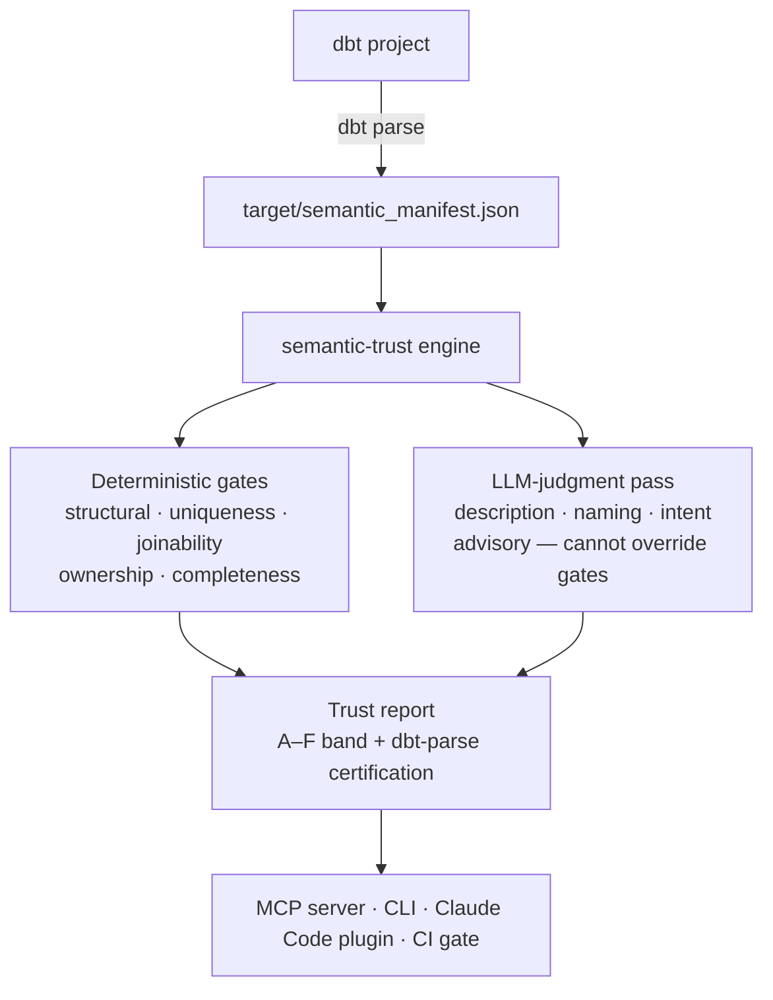

# semantic-trust

Certify that dbt Semantic Layer models are safe to promote — a deterministic trust score, LLM-judged quality, and a `dbt parse` compile check. Not another way to write YAML.

[](https://pypi.org/project/semantic-trust/)
[](https://github.com/rj1224/semantic-trust/actions/workflows/ci.yml)
[](https://pypi.org/project/semantic-trust/)
[](LICENSE)

---

## Why

dbt-labs' agent skills author semantic models — they scaffold YAML, wire measures, and generate metric definitions. `semantic-trust` picks up where authoring stops: it **scores** and **certifies** those models before they reach production.

Scoring runs five deterministic gates:

- **Structural** — required fields present, types correct, no dangling references.
- **Uniqueness** — no duplicate metric or dimension names across the project.
- **Joinability** — join paths resolve; foreign-key references match declared entities.
- **Ownership** — every model has an approved owner email (optionally domain-restricted).
- **Completeness** — descriptions, labels, and metric intent fields are populated.

On top of the gate results, an LLM-judgment pass evaluates description quality, naming clarity, and metric intent. The combined score maps to an **A–F trust band**. A model that clears all gates and passes LLM review earns an A; structural failures floor the score at F.

Certification adds a final compile check via `dbt parse`. A model that scores B or above and compiles cleanly is marked **certified** and safe to promote.

`semantic-trust` works on top of any dbt project — it reads the compiled `semantic_manifest.json` that `dbt parse` emits and requires no changes to your dbt project structure.

---

## How it works



The engine reads the **compiled** manifest (never raw YAML), so the same logic works on the legacy and the 1.12+/Fusion spec alike. The LLM-judgment pass is **advisory** — it can flag quality issues but can never override a deterministic gate or the trust band (enforced server-side).

---

## How it's different

**vs `mf validate-configs`** — MetricFlow's own validator pins `dbt-core<1.12`, so it
structurally cannot validate the current (1.12+/Fusion) Semantic Layer spec. semantic-trust
validates **both** the legacy and the current spec — today it is the only tool that checks
1.12+/Fusion semantic models at all.

**vs dbt-project-evaluator / dbt-checkpoint** — those lint your dbt *project* structure
(naming, staging layers, tests-exist, docs-exist). semantic-trust certifies your *Semantic
Layer* — metrics, entities, joinability, ownership, and description quality. Different object,
different failure mode: complementary, not redundant.

**vs dbt Fusion / `dbt parse` alone** — the compiler tells you a model is *valid*.
semantic-trust tells you it is *trustworthy* — the deterministic gates plus an LLM-judgment
pass on description quality, naming clarity, and metric intent that no compiler performs.

---

## Install

### Claude Code plugin

Add the marketplace and install the plugin:

```bash
claude plugin marketplace add rj1224/semantic-trust
claude plugin install semantic-trust@semantic-trust
```

The second command uses the format `<plugin-name>@<marketplace-name>` (here both are `semantic-trust`). You can also install via the `/plugin` menu inside a Claude Code session.

Once installed, the MCP server starts automatically — the plugin's `.mcp.json` launches it via `uvx --from semantic-trust semantic-trust-mcp`. No manual server step is needed.

### MCP server (standalone)

If you need to run the MCP server outside of the plugin:

```bash
uvx --from semantic-trust semantic-trust-mcp
```

This starts the `semantic-trust-mcp` stdio server, exposing three tools: `scaffold_semantic_model`, `score_semantic_model`, and `validate_semantic_model`.

---

## Quickstart

With the plugin installed, open a Claude Code session in your dbt project directory, then:

**Natural language:**

```
validate my semantic model
```

Claude routes this to the `validate-semantics` skill, which compiles your project, runs all five gates, applies LLM judgment, and returns a trust report with gate results, score, trust band, and any blocking issues.

**Slash command:**

```
/semantic-trust:validate <model>    # full trust report for a specific model
```

> Authoring is available via natural language — the `document-semantics` and `build-dbt-model` skills bootstrap a first-pass semantic model for a model that has none yet, as a ramp into validation. For production authoring, prefer dbt-labs' own Semantic Layer agent skills.

The trust report shows gate-by-gate pass/fail, the A–F band, and a recommendation (promote / fix-and-retry / escalate).

---

## dbt version support

`semantic-trust` supports both the legacy and the current dbt Semantic Layer spec:

| dbt Core version | Spec form | Notes |
|---|---|---|
| 1.6 – 1.11 | **Legacy** — top-level `semantic_models:` block + standalone `measures:` in `schema.yml` | `mf validate-configs` available as an additional validation pass |
| **1.12+** / Fusion | **Latest** — model-annotation form: semantic metadata lives inside `models:` blocks | `mf validate-configs` not supported (skipped automatically) |

`dbt parse` is the **universal compile gate** for both versions — `semantic-trust` always runs it first. `mf validate-configs` is a legacy-only bonus pass and is skipped automatically on 1.12+ projects.

The spec version is detected from `target/semantic_manifest.json` at runtime (the compiled output of `dbt parse`); no configuration is required.

---

## Not affiliated with dbt Labs

`semantic-trust` references the dbt ecosystem and is designed to work alongside dbt projects. It is **not** an official dbt product and is not affiliated with, endorsed by, or supported by dbt Labs, Inc.

The vendored content under `vendor/dbt-agent-skills/` consists of dbt-labs' public Semantic Layer spec guides, included under their Apache-2.0 license. See `vendor/dbt-agent-skills/NOTICE` for attribution and license terms. That content remains Apache-2.0; the rest of this project is MIT.

---

## Configuration

`semantic-trust` works with zero configuration. To enable the ownership gate's domain check, add a `.semantic-trust.json` file at your dbt project root:

```json
{
  "approved_email_domains": ["example.com"]
}
```

With `approved_email_domains` set, the ownership gate fails any model whose `owner.email` does not match one of the listed domains. Without this config key, the ownership gate only checks that an email is present.

No other configuration keys are required or supported.

---

## License

This project is licensed under the **MIT License** — see the `LICENSE` file.

Vendored content under `vendor/dbt-agent-skills/` is licensed under the **Apache-2.0 License** — see `vendor/dbt-agent-skills/NOTICE` and `vendor/dbt-agent-skills/LICENSE`.
